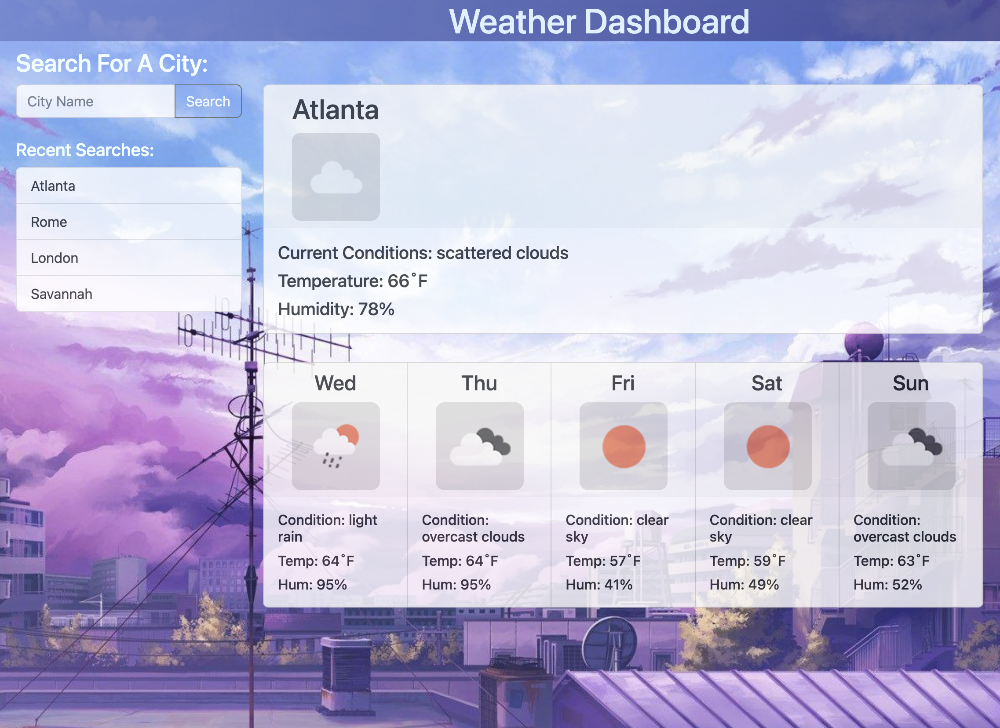

# Weather-Dashboard

### **Weather Dashboard with Search Bar, Local Storage Search History, Current Day and Five-Day Forecast**

[Work Day Scheduler Link](https://jweibelbootcamp.github.io/Weather-Dashboard//)

### **Description**
* A single page weather dashboard application with a a search function, including recent searches saved to local storage. Displays a large card for the current weather with the city name, weather icon, current conditions description, temperature in degrees Farenheit, and humidity. Below are smaller cards displaying a five-day forecast for the same city. Search history is clickable to search again. 

### **Technologies Used**
* HTML
* CSS
* JavaScript
* Bootstrap
* jQuery

### **Setup/Installation Instructions**
* Enter a city name and either click the search button or hit the enter key. If a recent search history exists, user may click those as well.

### **Known Bugs**
* None 

### **License**
* MIT  
* Copyright (c) 2022 Jason Weibel